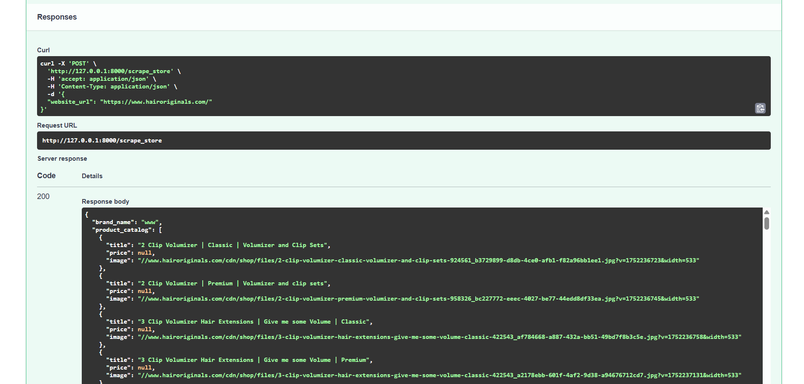

# 🛍️ Shopify Brand Scraper

This is a FastAPI-based service that scrapes a Shopify store and returns structured brand insights such as product catalog, policies, contact info, and more.

---

## 🚀 API Overview


## 📘 Swagger UI

### 🔹 Base UI and GET `/` Endpoint
The root endpoint gives basic API info.


---

### ✅ POST `/scrape_store`
Scrapes data from a given Shopify store and returns structured JSON.

**Example Request and Response:**




---


### 🔹 POST `/scrape_store` - Input Example

Submit a JSON body with a `website_url` key.

```json
{
  "website_url": "https://www.hairoriginals.com/"
}
